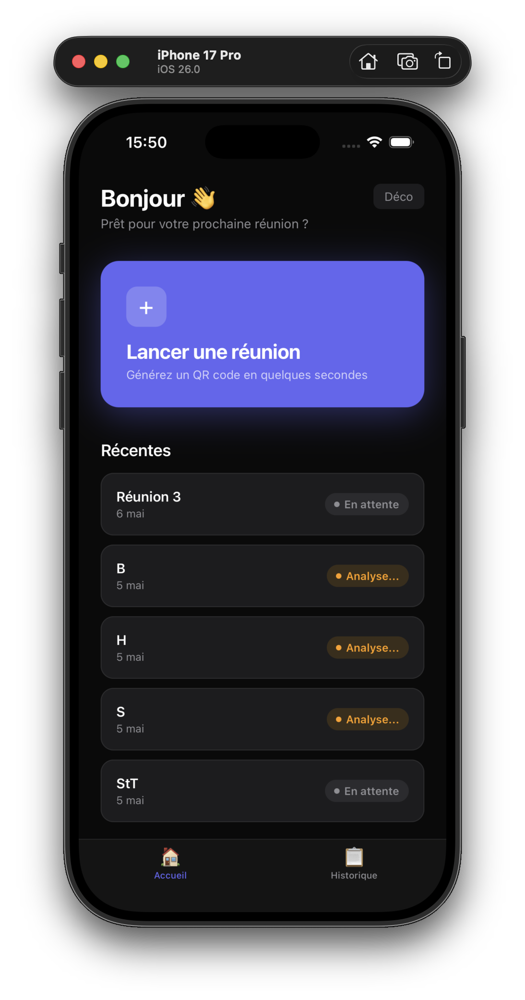
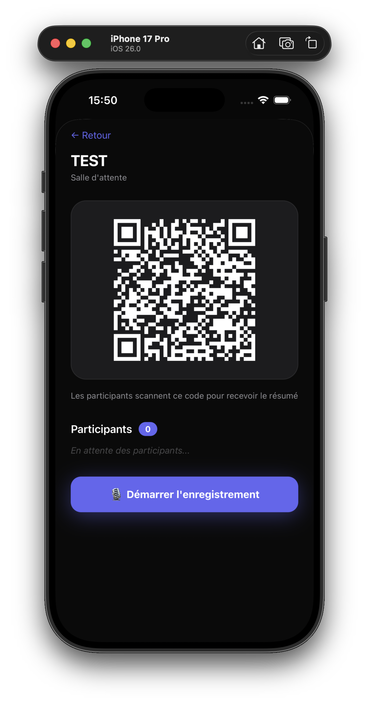
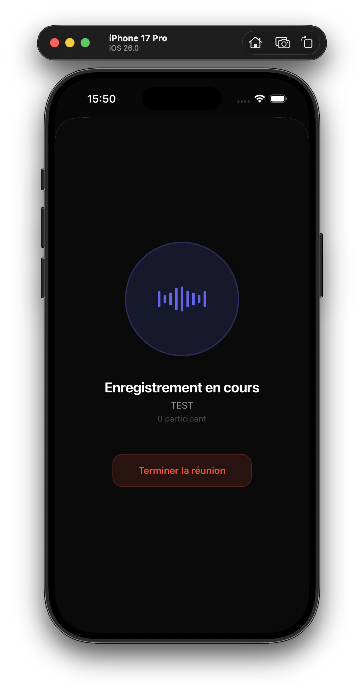
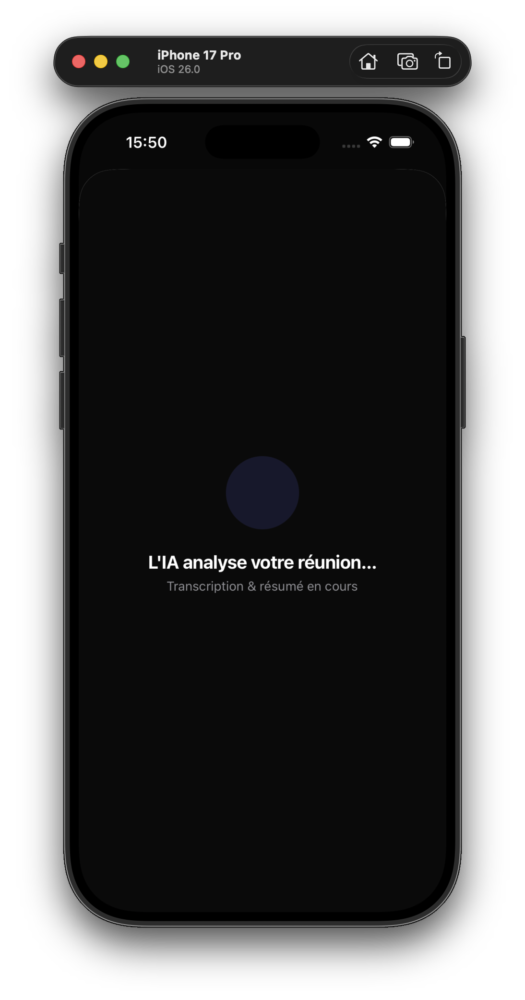

# MeetNote Mobile

Application mobile **iOS / Android** pour organiser des reunions, generer un QR code de participation, enregistrer l'audio, puis lancer un traitement IA (transcription + resume).

## Apercu

| Accueil | Salle d'attente (QR) |
|---|---|
|  |  |

| Enregistrement | Analyse IA |
|---|---|
|  |  |

## Fonctionnalites

- Authentification organisateur via Supabase Auth.
- Creation rapide d'une reunion depuis l'accueil.
- Generation d'un QR code unique pour inscription des participants.
- Mise a jour en temps reel de la liste des participants.
- Enregistrement audio depuis le mobile (Expo AV).
- Upload de l'audio vers Supabase Storage.
- Declenchement d'une Edge Function pour la transcription et le resume IA.
- Consultation du statut de reunion: waiting, recording, processing, done.

## Stack

- Expo (React Native + Expo Router)
- Supabase (Auth, Postgres, Realtime, Storage, Edge Functions)
- react-native-qrcode-svg
- expo-av / expo-keep-awake

## Prerequis

- Node.js 20+
- npm
- Compte Supabase configure
- Expo Go ou simulateur iOS/Android

## Installation

```bash
npm install
```

## Variables d'environnement

Creer un fichier `.env.local` a la racine du projet `meetnote`:

```env
EXPO_PUBLIC_SUPABASE_URL=https://YOUR_PROJECT.supabase.co
EXPO_PUBLIC_SUPABASE_ANON_KEY=YOUR_SUPABASE_ANON_KEY
EXPO_PUBLIC_APP_URL=https://YOUR_WEB_APP_DOMAIN
```

Important:

- Ne jamais versionner les secrets.
- Le `.gitignore` est configure pour ignorer les fichiers d'environnement locaux.

## Lancer l'application

```bash
npm run start
```

Puis:

- `i` pour ouvrir iOS
- `a` pour ouvrir Android
- `w` pour ouvrir Web

Ou directement:

```bash
npm run ios
npm run android
npm run web
```

## Workflow produit

1. L'organisateur cree une reunion.
2. L'app affiche un QR code d'inscription.
3. Les participants scannent et entrent leur email depuis la web app.
4. L'organisateur demarre puis termine l'enregistrement.
5. L'app upload l'audio et invoque la fonction `process-meeting`.
6. La reunion passe en `processing`, puis en `done` une fois le resume genere.

## Structure utile

```text
app/
  (tabs)/index.tsx        # Ecran d'accueil
  (tabs)/history.tsx      # Historique
  meeting/[id].tsx        # QR + enregistrement + resume
hooks/useMeetings.ts      # CRUD / abonnements reunions
lib/supabase.ts           # Client Supabase + types
supabase/functions/process-meeting/index.ts  # Pipeline IA
assets/screenshots/       # Captures d'ecran README
```

## Notes securite

- Les fichiers temporaires locaux Supabase sont ignores (`supabase/.temp/`).
- Verifier regulierement que `.env.local` n'est pas suivi par Git:

```bash
git ls-files .env.local
```

## Licence

Ce projet est distribue sous la licence `MeetNote Non-Commercial License (MNCL) v1.0`.

- Utilisation, modification et partage autorises pour un usage non commercial.
- Vente, revente, usage SaaS payant et toute commercialisation interdits sans autorisation ecrite.
- Voir le fichier `LICENSE` pour le texte complet.